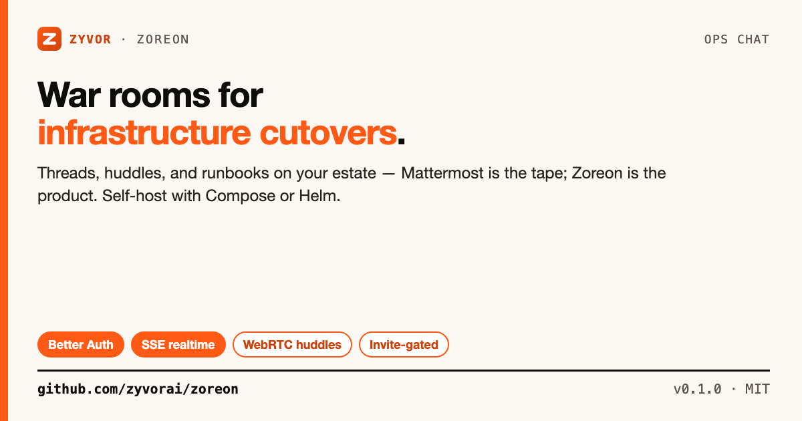
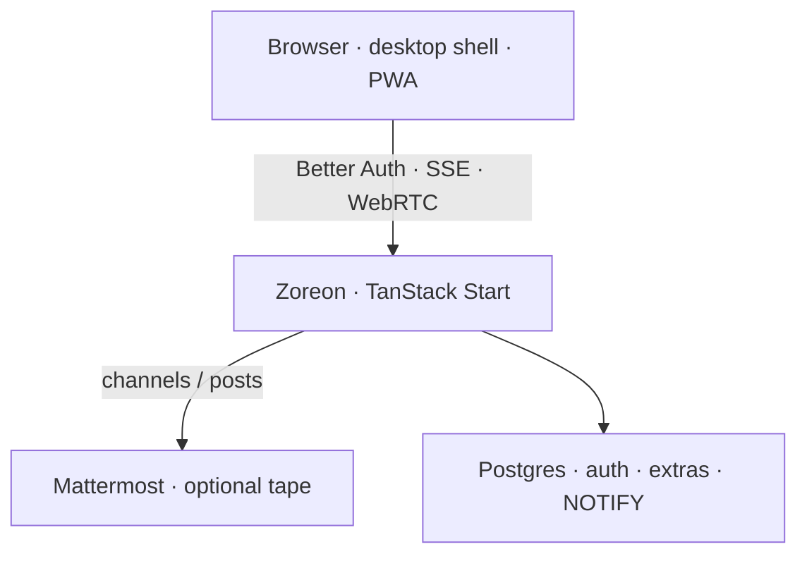

# Zoreon

[](https://github.com/zyvorai/zoreon/actions/workflows/ci.yml)
[](LICENSE)
[](package.json)



**Ops chat for infrastructure cutovers — war rooms, threads, huddles, and runbooks on your estate.**

Mattermost is the *tape*. Zoreon is the *product*. Self-host with Docker Compose, Helm, or podman/systemd — your network, your secrets.

📖 **[Customer deploy guide](docs/CUSTOMER.md)** · [Helm](docs/HELM.md) · [Architecture](docs/ARCHITECTURE.md) · [Docs index](docs/README.md)

## Contents

- [Why Zoreon](#why-zoreon)
- [What you get](#what-you-get)
- [Quick start](#quick-start)
- [Deploy](#deploy)
- [Architecture](#architecture)
- [Docs](#docs)
- [Layout](#layout)
- [License](#license)

## Why Zoreon

Cutover programs need a war room that lives next to the tape — not another SaaS chat island.

| | |
| --- | --- |
| **Better Auth** | Email/password + Google / X. Invite-gated join. |
| **Mattermost tape** | Optional durable channel history when you already run MM. |
| **Zoreon Postgres** | Invites, stars, pins, bookmarks, reminders, admin, search, prefs, push. |
| **Realtime** | SSE + Postgres `LISTEN`/`NOTIFY` across replicas. |
| **Huddles** | In-channel A/V over WebRTC. |
| **Self-host** | Compose, Helm, or podman/systemd — your network, your secrets. |

## What you get

| Surface | Details |
| --- | --- |
| Channels & DMs | Threads, reactions, edit/delete, markdown, @mentions |
| Cutover extras | Stars, pins, bookmarks, remind-in-1h, war-room waves |
| Search | Palette filters `from:` `in:` `has:` `before:` `after:` + saved searches |
| Notifications | Mute / mentions-only, desktop prefs, quiet hours |
| Admin | Workspace admins, retention, audit log |
| Invites | Multi-use link, SMTP send, or mailto |
| PWA | Service worker, manifest, offline draft outbox; Web Push with `VAPID_*` |

## Quick start

```bash
git clone https://github.com/zyvorai/zoreon.git
cd zoreon
npm install
npm run dev
```

Open [http://localhost:8080/login](http://localhost:8080/login).

```bash
npm run typecheck && npm test && npm run build
```

## Deploy

### Docker Compose (recommended)

```bash
cp .env.example .env   # secrets + ZOREON_BOOTSTRAP_ADMIN_EMAIL
docker compose up -d --build
BASE_URL=http://localhost:8080 ./scripts/customer-smoke.sh
```

Full lifecycle (bootstrap admin, TLS, SMTP, Mattermost): **[docs/CUSTOMER.md](docs/CUSTOMER.md)**.

### Kubernetes

```bash
helm upgrade --install zoreon ./charts/zoreon \
  --namespace zoreon --create-namespace \
  --set image.repository=your-registry/zoreon \
  --set image.tag=0.1.0 \
  --set env.BETTER_AUTH_URL=https://zoreon.example.com \
  --set secret.BETTER_AUTH_SECRET="$(openssl rand -hex 32)"
```

Guide: **[docs/HELM.md](docs/HELM.md)**.

### Advanced single-host

`scripts/deploy-remote.sh` → podman + systemd + HTTPS proxy. Defaults: `zoreon-db` / `zoreon-net` / `zoreon-pgdata` (legacy `agora-*` auto-migrated). See **[docs/DEPLOY.md](docs/DEPLOY.md)**.

## Architecture



| Plane | Role |
| --- | --- |
| Browser | Session, SSE `/api/zoreon/events`, huddles via `/api/rtc` |
| Zoreon | Product API, invites, admin, search, overlays |
| Mattermost | Optional durable messaging when `MATTERMOST_*` is set |
| Postgres | Auth + product extras; multi-replica realtime fan-out |

More: **[docs/ARCHITECTURE.md](docs/ARCHITECTURE.md)**.

> SQL tables keep the historical `agora_*` prefix. Product and repo name are **zoreon**.

## Docs

| Doc | For |
| --- | --- |
| [CUSTOMER.md](docs/CUSTOMER.md) | Organizations — Compose, bootstrap, TLS |
| [HELM.md](docs/HELM.md) | Kubernetes chart |
| [TESTING.md](docs/TESTING.md) | Unit, curl smoke, Playwright, browser checklist |
| [ENV.md](docs/ENV.md) | Environment variables |
| [DEPLOY.md](docs/DEPLOY.md) | Advanced podman/systemd |
| [OPERATIONS.md](docs/OPERATIONS.md) | Day-2 host ops |
| [docs/README.md](docs/README.md) | Index |

CI on every push/PR to `main`: unit → HTTP smoke → Playwright (Postgres service).

## Layout

| Path | What |
| --- | --- |
| `src/components/desktop/` | Shell, invite/admin, palette |
| `src/components/zoreon/` | Channels, messages, threads, huddles |
| `src/lib/zoreon/` | Server API, Mattermost, mail, realtime |
| `charts/zoreon/` | Helm chart |
| `docker-compose.yml` | Greenfield Postgres + app |
| `e2e/` | Playwright smoke |
| `scripts/customer-smoke.sh` | HTTP smoke against `BASE_URL` |
| `scripts/deploy-remote.sh` | Advanced remote deploy |

## License

[MIT](LICENSE) · [Zyvor AI Labs](https://zyvor.dev)
