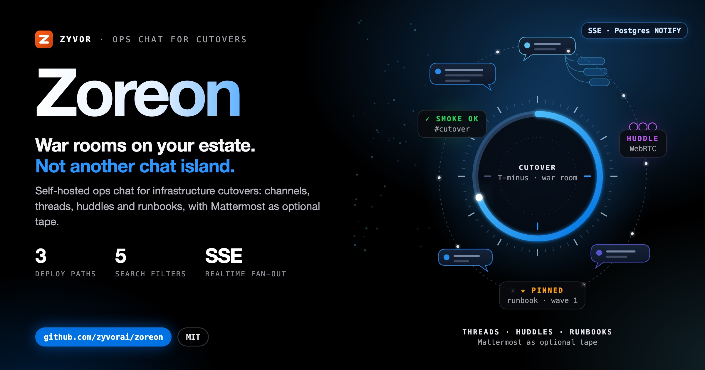
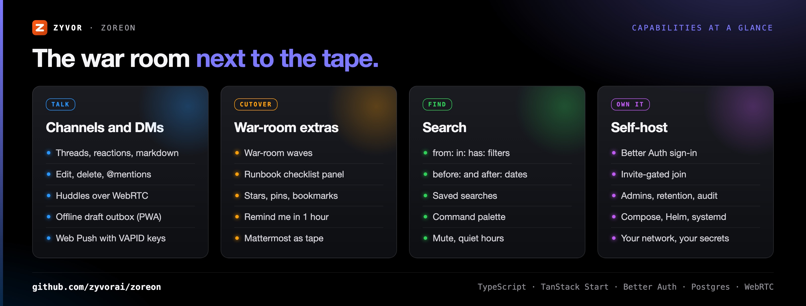
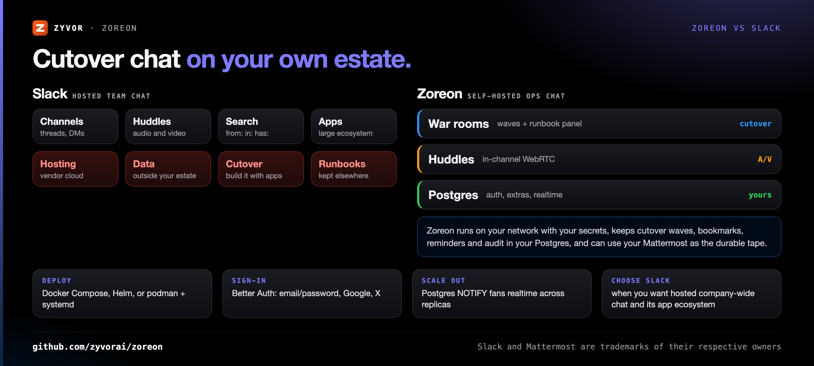
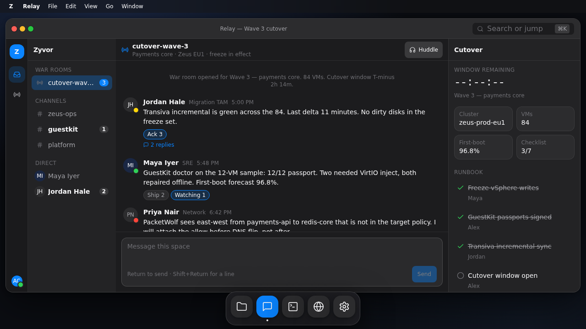
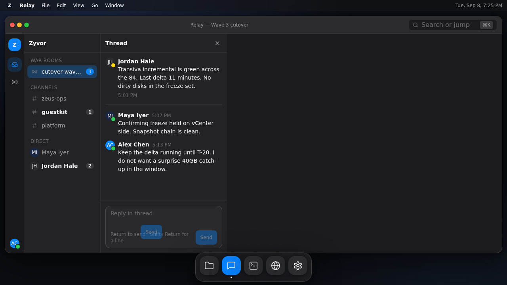
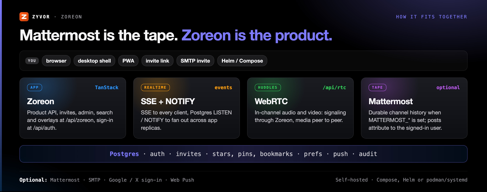
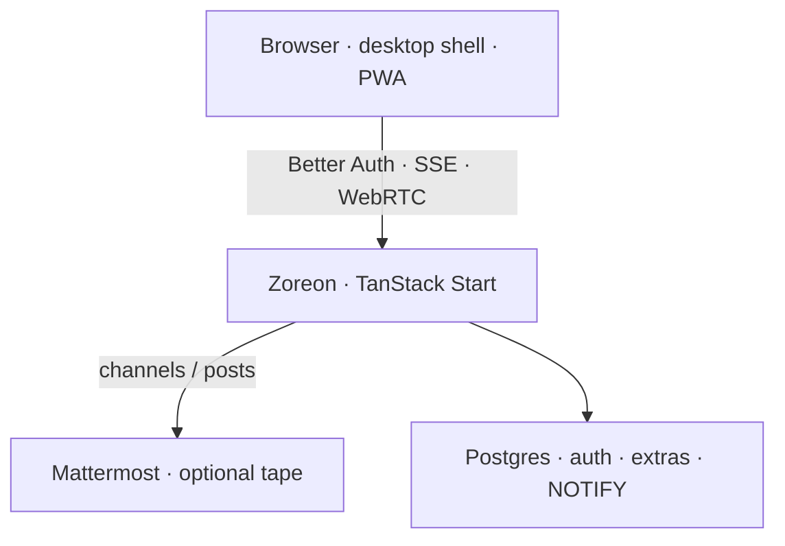

<div align="center">

# Zoreon

<a href="https://github.com/zyvorai/zoreon/actions/workflows/ci.yml"></a>
<a href="LICENSE"></a>
<a href="package.json"></a>
<a href="https://github.com/zyvorai/zoreon"></a>
<a href="docs/CUSTOMER.md"></a>

[](https://zyvor.dev/schedule?utm_source=github&utm_medium=zoreon&utm_campaign=readme_hero)
[](https://zyvor.dev/poc?utm_source=github&utm_medium=zoreon&utm_campaign=readme_hero)
[](#quickstart)

<a href="#quickstart">Quickstart</a> ·
<a href="#deploy">Deploy</a> ·
<a href="#what-you-get">Features</a> ·
<a href="#architecture">Architecture</a> ·
<a href="#docs">Docs</a>



### War rooms on your estate. Not another chat island.

**Ops chat for infrastructure cutovers.** War rooms, threads, huddles, and runbooks — on your estate, with your secrets. Mattermost is the *tape*. Zoreon is the *product*.

**Self-hosted** · **3 deploy paths** · **Realtime across replicas** · **In-channel huddles** · **Invite-gated join**

</div>

---

## Why Zoreon

Cutover programs need a war room that lives next to the tape — not another SaaS chat island.

| When this happens… | Zoreon gives you… |
|---|---|
| The cutover war room lives in a SaaS chat you don't control | Self-hosted ops chat on Compose, Helm, or podman/systemd — your network, your secrets |
| You already run Mattermost and don't want a second source of history | Mattermost as optional durable tape; posts attribute to the signed-in user |
| The critical message from an hour ago is buried | Stars, pins, bookmarks, remind-in-1h, and search with `from:` `in:` `has:` `before:` `after:` plus saved searches |
| The bridge call happens somewhere else | In-channel audio/video huddles over WebRTC |
| Anyone with the URL could sign up | Better Auth with email/password or Google / X, and invite-gated join |
| One app replica isn't enough on cutover night | SSE with Postgres `LISTEN`/`NOTIFY` fan-out across replicas |

| | |
| --- | --- |
| **Better Auth** | Email/password + Google / X. Invite-gated join. |
| **Mattermost tape** | Optional durable channel history when you already run MM. |
| **Zoreon Postgres** | Invites, stars, pins, bookmarks, reminders, admin, search, prefs, push. |
| **Realtime** | SSE + Postgres `LISTEN`/`NOTIFY` across replicas. |
| **Huddles** | In-channel A/V over WebRTC. |
| **Self-host** | Compose, Helm, or podman/systemd — your network, your secrets. |



## What you get

| Surface | Details |
| --- | --- |
| Channels & DMs | Threads, reactions, edit/delete, markdown, @mentions |
| Cutover extras | Stars, pins, bookmarks, remind-in-1h, war-room waves |
| Search | Palette filters `from:` `in:` `has:` `before:` `after:` + saved searches |
| Notifications | Mute / mentions-only, desktop prefs, quiet hours |
| Admin | Workspace admins, retention, audit log |
| Invites | Multi-use link, SMTP send, or mailto |
| PWA | Service worker, manifest, offline draft outbox; Web Push with `VAPID_*` |

---

## Zoreon vs Slack



| | **Zoreon** | **Slack** (hosted team chat) |
|---|---|---|
| Where it runs | Your infrastructure: Docker Compose, Helm, or podman + systemd | Slack's cloud service |
| Where messages live | Your Postgres, optionally with your Mattermost as durable tape | Slack's service |
| Sign-in | Better Auth (email/password, Google, X) with invite-gated join | Slack accounts and workspace invitations |
| Channels, threads, DMs | Yes | Yes |
| Audio/video | In-channel huddles over WebRTC | Huddles and calls |
| Cutover workflow | War-room waves, stars, pins, bookmarks, remind-in-1h, workspace audit log | General-purpose; cutover workflow comes from apps and conventions |
| Integrations | Mattermost tape, SMTP invites, Web Push | Large app and integration ecosystem |
| **Choose Slack when** | | You want hosted, company-wide chat with its app ecosystem and don't need the war room on your own estate |

---

## See it live

| War room | Thread |
|---|---|
|  |  |
| A cutover war room: channels, DMs, the cutover window, the runbook checklist and the Huddle button | Replying in a thread without leaving the war room |

These are lab captures of an earlier build; the window title predates the Zoreon name.

---

## How it fits together



### Architecture


```mermaid
flowchart TB
  browser["Browser · desktop shell · PWA"]
  zoreon["Zoreon · TanStack Start"]
  mm["Mattermost · optional tape"]
  pg["Postgres · auth · extras · NOTIFY"]

  browser -->|Better Auth · SSE · WebRTC| zoreon
  zoreon -->|channels / posts| mm
  zoreon --> pg
```

| Plane | Role |
| --- | --- |
| Browser | Session, SSE `/api/zoreon/events`, huddles via `/api/rtc` |
| Zoreon | Product API, invites, admin, search, overlays |
| Mattermost | Optional durable messaging when `MATTERMOST_*` is set |
| Postgres | Auth + product extras; multi-replica realtime fan-out |

More: **[docs/ARCHITECTURE.md](docs/ARCHITECTURE.md)**.

> SQL tables keep the historical `agora_*` prefix. Product and repo name are **zoreon**.

---

<a id="quick-start"></a>

## Quickstart

```bash
git clone https://github.com/zyvorai/zoreon.git
cd zoreon
npm install
npm run dev
```

Open [http://localhost:8080/login](http://localhost:8080/login).

```bash
npm run typecheck && npm test && npm run build
```

## Deploy

### Docker Compose (recommended)

```bash
cp .env.example .env   # secrets + ZOREON_BOOTSTRAP_ADMIN_EMAIL
docker compose up -d --build
BASE_URL=http://localhost:8080 ./scripts/customer-smoke.sh
```

Full lifecycle (bootstrap admin, TLS, SMTP, Mattermost): **[docs/CUSTOMER.md](docs/CUSTOMER.md)**.

### Kubernetes

```bash
helm upgrade --install zoreon ./charts/zoreon \
  --namespace zoreon --create-namespace \
  --set image.repository=your-registry/zoreon \
  --set image.tag=0.1.0 \
  --set env.BETTER_AUTH_URL=https://zoreon.example.com \
  --set secret.BETTER_AUTH_SECRET="$(openssl rand -hex 32)"
```

Guide: **[docs/HELM.md](docs/HELM.md)**.

### Advanced single-host

`scripts/deploy-remote.sh` → podman + systemd + HTTPS proxy. Defaults: `zoreon-db` / `zoreon-net` / `zoreon-pgdata` (legacy `agora-*` auto-migrated). See **[docs/DEPLOY.md](docs/DEPLOY.md)**.

## Docs

| Doc | For |
| --- | --- |
| [CUSTOMER.md](docs/CUSTOMER.md) | Organizations — Compose, bootstrap, TLS |
| [HELM.md](docs/HELM.md) | Kubernetes chart |
| [TESTING.md](docs/TESTING.md) | Unit, curl smoke, Playwright, browser checklist |
| [ENV.md](docs/ENV.md) | Environment variables |
| [DEPLOY.md](docs/DEPLOY.md) | Advanced podman/systemd |
| [OPERATIONS.md](docs/OPERATIONS.md) | Day-2 host ops |
| [docs/README.md](docs/README.md) | Index |

CI on every push/PR to `main`: unit → HTTP smoke → Playwright (Postgres service).

## Layout

| Path | What |
| --- | --- |
| `src/components/desktop/` | Shell, invite/admin, palette |
| `src/components/zoreon/` | Channels, messages, threads, huddles |
| `src/lib/zoreon/` | Server API, Mattermost, mail, realtime |
| `charts/zoreon/` | Helm chart |
| `docker-compose.yml` | Greenfield Postgres + app |
| `e2e/` | Playwright smoke |
| `scripts/customer-smoke.sh` | HTTP smoke against `BASE_URL` |
| `scripts/deploy-remote.sh` | Advanced remote deploy |

---

## Maturity

Zoreon is at version **0.1.0** (`package.json`, and the image tag in the Helm example).

| Part | Status |
|---|---|
| Channels, DMs, threads, search, invites, admin, huddles, PWA | Shipped in the product |
| Mattermost tape | Optional: active when `MATTERMOST_URL` and `MATTERMOST_TOKEN` are set; otherwise a local SQL message path |
| Web Push | Optional: needs `VAPID_*` keys |
| SMTP invites | Optional: multi-use links and mailto work without it |

---

## Part of the Zyvor stack

| Product | Role next to Zoreon |
|---|---|
| **Zoreon** | Ops chat and war rooms for infrastructure cutovers |
| **[Scout](https://github.com/zyvorai/scout)** | Migration readiness and wave planning; pairs with Zoreon's war-room waves |
| **[Transiva](https://github.com/zyvorai/zyvor-transiva)** | VM export from vSphere and Nutanix; the kind of cutover step a Zoreon war room coordinates |
| **[GuestKit](https://github.com/zyvorai/zyvor-guestkit)** | Offline VM assurance and cutover Passports, next to the runbook in the war room |
| **[h2kvm](https://github.com/zyvorai/zyvor-h2kvm)** | Hypervisor-to-KVM migration; pairs with Zoreon on cutover night |

→ [zyvor.dev](https://zyvor.dev)

---

## License

Zoreon is **free and open source** under the [MIT License](LICENSE) · [Zyvor AI Labs](https://zyvor.dev).

**Zyvor Enterprise** adds what production teams ask for: supported releases, deployment and upgrade guidance, priority incident triage, a named technical contact and 24x7 critical intake. Plans and terms: [docs/SUBSCRIPTION-MODEL.md](docs/SUBSCRIPTION-MODEL.md) · [Pricing](https://zyvor.dev/pricing?utm_source=github&utm_medium=zoreon&utm_campaign=readme_license) · [sales@zyvor.dev](mailto:sales@zyvor.dev).

---

<div align="center">

### Run your next cutover from your own war room

[](https://zyvor.dev/schedule?utm_source=github&utm_medium=zoreon&utm_campaign=readme_footer)
[](https://zyvor.dev/poc?utm_source=github&utm_medium=zoreon&utm_campaign=readme_footer)
[](https://zyvor.dev/pricing?utm_source=github&utm_medium=zoreon&utm_campaign=readme_footer)
[](mailto:sales@zyvor.dev?subject=Zoreon)
[](https://github.com/zyvorai/zoreon)

</div>
