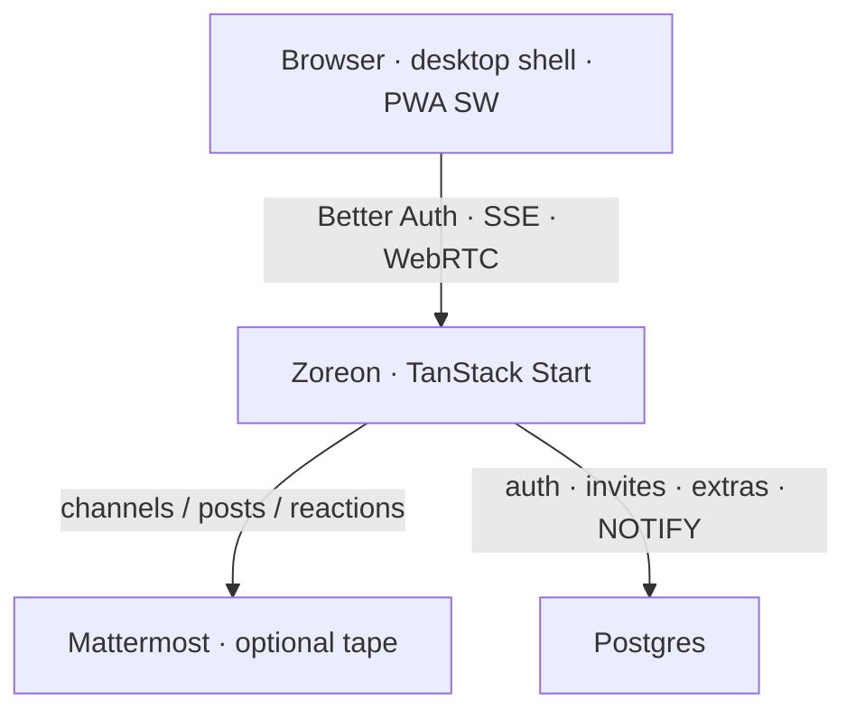

# Architecture

Zoreon is Zyvor’s ops-chat product for infrastructure cutovers.

**Mattermost is the tape** (durable channel history when configured).  
**Zoreon is the product** (login, invites, search, prefs, admin, PWA, huddles, cutover waves).

## Planes

| Layer | Responsibility |
| --- | --- |
| Browser | Session cookie, SSE client, huddle media |
| Zoreon | `/api/auth`, `/api/zoreon/*`, `/api/rtc`, server functions |
| Mattermost | Optional REST tape when `MATTERMOST_URL` + `MATTERMOST_TOKEN` are set |
| Postgres | Better Auth tables, invites, stars/pins/bookmarks, prefs, push, audit |

## Auth

- **Better Auth** at `/api/auth/*` — email/password + Google / X.
- New accounts require a valid **invite** (`/join?token=…`).
- Workspace admins: `agora_workspace_admins` (historical table prefix).
- Bootstrap: `ZOREON_BOOTSTRAP_ADMIN_EMAIL` seeds the first admin on migrate ([CUSTOMER.md](CUSTOMER.md)).

## Messaging

| Mode | Behavior |
| --- | --- |
| Mattermost wired | Channels/messages/send/reactions via MM. Per-user access tokens in `agora_mm_tokens` (encrypted) so posts attribute to the signed-in user. |
| No MM token | Local SQL path (`agora_messages` seed). |

Cutover waves, bookmarks, reminders, stars, overlays, and admin audit always live on Zoreon Postgres.

## Realtime

- Clients open SSE to `/api/zoreon/events`.
- In-process hub **plus** Postgres `NOTIFY zoreon_realtime` so multiple app replicas fan out.

## Huddles

- UI: `HuddleBar` in the channel header.
- Signaling: `/api/rtc` (peer discovery / SDP relay).
- Media: `getUserMedia` + peer connections (`P2PRoom`).

## PWA / push

- Service worker: `public/sw.js`.
- Manifest: `/__grok/manifest.webmanifest`.
- Offline draft outbox in the client store.
- Web Push optional via `VAPID_*` + `agora_push_subscriptions`.

## Packaging

| Artifact | Role |
| --- | --- |
| `docker-compose.yml` | Greenfield Postgres + app |
| `charts/zoreon` | Helm Deployment, Service, Ingress, optional Postgres |
| `scripts/deploy-remote.sh` | Lab/advanced: podman + systemd; `zoreon-*` volumes (legacy `agora-*` migrated) |

## Naming

| Name | Scope |
| --- | --- |
| **zoreon** | Product, GitHub repo, Compose/Helm/service defaults |
| `agora_*` | Historical SQL table prefix — do not rename casually on a live DB |
| `agora-*` volumes | Legacy lab names; deploy script renames/reuses automatically |

## Related

- [CUSTOMER.md](CUSTOMER.md) · [HELM.md](HELM.md) · [ENV.md](ENV.md) · [TESTING.md](TESTING.md)
