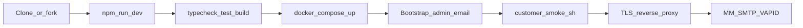

# Customer guide — code, deploy, test

How another organization runs **[Zoreon](https://github.com/zyvorai/zoreon)** without Zyvor-internal hosts or paths.

**Preferred self-host path:** Docker Compose (this doc).  
**Advanced:** single Linux host with podman/systemd — see [DEPLOY.md](DEPLOY.md).



## 1. Get the code

```bash
git clone https://github.com/zyvorai/zoreon.git
cd zoreon
# or: fork on GitHub, then clone your fork
```

## 2. Develop locally

```bash
npm install
npm run dev
```

Open `http://localhost:8080/login`. For full auth + Postgres extras, use Compose (below) or set `DATABASE_URL` against a local Postgres and enable auth in your env.

Developer checks before you ship a change:

```bash
npm run typecheck
npm test
npm run build
```

See [TESTING.md](TESTING.md).

## 3. Configure

```bash
cp .env.example .env
# edit .env — at minimum secrets + public URL + bootstrap admin
```

| Must set | Example |
| --- | --- |
| `BETTER_AUTH_SECRET` | long random string (`openssl rand -hex 32`) |
| `BETTER_AUTH_URL` | `http://localhost:8080` (Compose) or `https://zoreon.example.com` |
| `ZOREON_BOOTSTRAP_ADMIN_EMAIL` | `admin@example.com` (your first admin) |
| `POSTGRES_PASSWORD` | strong password (Compose DB) |

Optional: `MATTERMOST_URL` / `MATTERMOST_TOKEN`, `SMTP_*`, `VAPID_*` — see [ENV.md](ENV.md).

## 4. Self-host with Compose (greenfield)

```bash
docker compose up -d --build
```

This starts:

- **db** — Postgres 16 (`zoreon` user/database; volume `zoreon-pgdata`)
- **app** — Zoreon image from [`Dockerfile`](../Dockerfile); migrations run on start

App listens on host port **8080** by default (`ZOREON_PUBLISH_PORT` to override).

> Lab / Zyvor single-host installs use `scripts/deploy-remote.sh` (auto-migrates legacy `agora-*` volumes). Compose is for **new** customer deployments only.

### First admin and invites

1. Set `ZOREON_BOOTSTRAP_ADMIN_EMAIL` before the first start (or restart after setting it).
2. Open `/login` and create that user’s account via an invite:
   - Air-gapped bootstrap: insert an invite row or temporarily promote via SQL (see below), **or**
   - Use SQL to create a one-shot invite token if you have DB access (ops runbook), **or**
   - Prefer: after bootstrap email is in `agora_workspace_admins`, use a DB one-liner to insert a multi-use invite (see [OPERATIONS](OPERATIONS.md) patterns) — simplest path documented next.

**Practical first-login path:**

On migrate/start, if `ZOREON_BOOTSTRAP_ADMIN_EMAIL` is set, Zoreon:

1. Inserts that email into `agora_workspace_admins`
2. Ensures at least one active invite token exists

Then:

```bash
# Print the active invite token (example)
docker compose exec db psql -U zoreon -d zoreon -c \
  "select token from agora_invites where revoked_at is null order by created_at desc limit 1;"
```

Open `/join?token=<token>`, register with the **same email** as `ZOREON_BOOTSTRAP_ADMIN_EMAIL`, sign in, then use **Invite people** for everyone else.

**Admin / invite SQL fallbacks:**

```sql
insert into agora_workspace_admins (email)
values ('admin@example.com')
on conflict (email) do nothing;

insert into agora_invites (token, created_by)
values (encode(gen_random_bytes(18), 'base64'), 'bootstrap')
on conflict (token) do nothing;
-- Prefer: select an existing active token, or insert a known token string you control.
```

## 5. Optional integrations

| Integration | Env | Notes |
| --- | --- | --- |
| Mattermost tape | `MATTERMOST_URL`, `MATTERMOST_TOKEN` | Channels/history on MM; product extras stay in Postgres |
| SMTP invites | `SMTP_HOST`, `SMTP_FROM`, `SMTP_USER`/`SMTP_PASS` | Enables **Send** in Invite dialog |
| Web Push | `VAPID_PUBLIC_KEY`, `VAPID_PRIVATE_KEY` | SW always registers; push needs VAPID |

## 6. Production TLS

Compose exposes HTTP on `:8080`. Put a reverse proxy in front with your certificates:

- **Caddy / nginx / Traefik** → `http://127.0.0.1:8080` (or the Compose published port)
- Set `BETTER_AUTH_URL` to the public `https://…` origin and recreate the app container

## 7. Test the deployment

```bash
BASE_URL=http://localhost:8080 ./scripts/customer-smoke.sh
```

Then run the browser checklist in [TESTING.md](TESTING.md).

## 8. Day-2

- Logs: `docker compose logs -f app`
- Upgrade: `git pull && docker compose up -d --build`
- Advanced single-host script: [DEPLOY.md](DEPLOY.md)

## Related

- [TESTING.md](TESTING.md) — unit, smoke, browser acceptance  
- [ENV.md](ENV.md) — full variable reference  
- [ARCHITECTURE.md](ARCHITECTURE.md) — product planes  
- [DEPLOY.md](DEPLOY.md) — advanced podman/systemd path  
