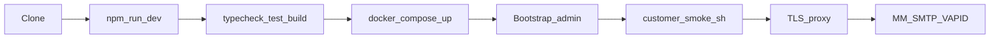

# Customer guide — code, deploy, test

How an organization runs **[Zoreon](https://github.com/zyvorai/zoreon)** without Zyvor-internal hosts or paths.

| Path | Use when |
| --- | --- |
| **Docker Compose** (this doc) | Greenfield self-host — preferred |
| [HELM.md](HELM.md) | You already run Kubernetes |
| [DEPLOY.md](DEPLOY.md) | Single Linux host, podman + systemd |



## 1. Get the code

```bash
git clone https://github.com/zyvorai/zoreon.git
cd zoreon
```

## 2. Develop locally

```bash
npm install
npm run dev
```

Open `http://localhost:8080/login`.

```bash
npm run typecheck
npm test
npm run build
```

Details: [TESTING.md](TESTING.md). GitHub Actions runs the same gates (plus Playwright) on `main`.

## 3. Configure

```bash
cp .env.example .env
```

| Must set | Example |
| --- | --- |
| `BETTER_AUTH_SECRET` | `openssl rand -hex 32` |
| `BETTER_AUTH_URL` | `http://localhost:8080` or `https://zoreon.example.com` |
| `ZOREON_BOOTSTRAP_ADMIN_EMAIL` | `admin@example.com` |
| `POSTGRES_PASSWORD` | Strong password (Compose DB) |

Optional: `MATTERMOST_URL` / `MATTERMOST_TOKEN`, `SMTP_*`, `VAPID_*` — [ENV.md](ENV.md).

## 4. Self-host with Compose

```bash
docker compose up -d --build
```

| Service | Role |
| --- | --- |
| **db** | Postgres 16 — user/db `zoreon`, volume `zoreon-pgdata` |
| **app** | Image from [`Dockerfile`](../Dockerfile); migrations on start |

Default publish port **8080** (`ZOREON_PUBLISH_PORT` to override).

> Zyvor lab / single-host installs use `scripts/deploy-remote.sh`, which defaults to `zoreon-*` volumes and auto-migrates legacy `agora-*` when present. Compose is for **new** customer deployments.

### First admin

On migrate/start, if `ZOREON_BOOTSTRAP_ADMIN_EMAIL` is set, Zoreon:

1. Inserts that email into `agora_workspace_admins`
2. Ensures at least one active invite token exists

```bash
docker compose exec db psql -U zoreon -d zoreon -c \
  "select token from agora_invites where revoked_at is null order by created_at desc limit 1;"
```

Open `/join?token=<token>`, register with the **same email**, sign in, then **Invite people** for others.

**SQL fallbacks:**

```sql
insert into agora_workspace_admins (email)
values ('admin@example.com')
on conflict (email) do nothing;

insert into agora_invites (token, created_by)
values (encode(gen_random_bytes(18), 'base64'), 'bootstrap')
on conflict (token) do nothing;
```

## 5. Optional integrations

| Integration | Env | Notes |
| --- | --- | --- |
| Mattermost tape | `MATTERMOST_URL`, `MATTERMOST_TOKEN` | Channels/history on MM; product extras stay in Postgres |
| SMTP invites | `SMTP_HOST`, `SMTP_FROM`, `SMTP_USER` / `SMTP_PASS` | Enables **Send** in Invite dialog |
| Web Push | `VAPID_PUBLIC_KEY`, `VAPID_PRIVATE_KEY` | SW always registers; push needs VAPID |

## 6. Production TLS

Compose exposes HTTP on `:8080`. Put Caddy / nginx / Traefik in front, set `BETTER_AUTH_URL` to the public `https://…` origin, recreate the app container.

## 7. Verify

```bash
BASE_URL=http://localhost:8080 ./scripts/customer-smoke.sh
```

Then the browser checklist in [TESTING.md](TESTING.md).

## 8. Day-2

```bash
docker compose logs -f app
git pull && docker compose up -d --build
```

Advanced single-host: [DEPLOY.md](DEPLOY.md) · [OPERATIONS.md](OPERATIONS.md).

## Related

- [HELM.md](HELM.md) — Kubernetes  
- [ENV.md](ENV.md) — full variable reference  
- [ARCHITECTURE.md](ARCHITECTURE.md) — product planes  
- [TESTING.md](TESTING.md) — CI, smoke, Playwright  
